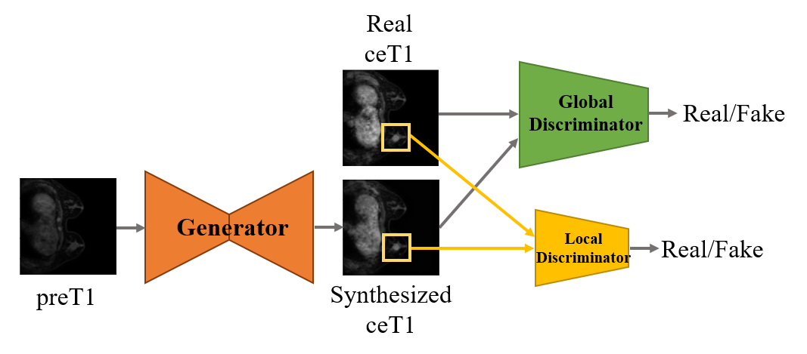
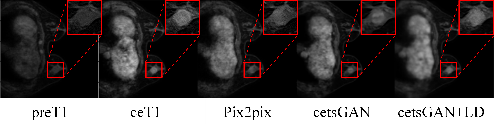

<h1 align="center">
    
 Stable Medical GAN 

    
### For model to synthesize contrast enhanced breast images
#### key words : MRI, T1 contrast-enhanced, synthesized, Generative-Adversarial Network, Self-attention, Residual Network
</h1>

## Objective
We aimed to **synthesize contrast-enhanced T1-weighted MRI (ceT1) image from pre-contrast T1-weighted MRI (preT1)**. We develped a generative adversarial network (GAN) to synthesize the ceT1 image better in particular to tumor region of interests (ROI). It consisted of 1 generator, 2 discriminator (**local disciminator for tumor**) and was performed to synthesize more authentic ceT1 images.

  

## Data Description
This experiment has been conducted by using Breast dynamic contrast T1-weighted MRI (DCE MRI) supported by Samsung Medical Centor and Gil Hospital.

DCE MRI have several series images, especially we used pre-contrast image (preT1) before the contrast agenet injection and contrast-enhanced image (ceT1) performing at 90 sec.

## Code Description
All the things about TSGAN are coded by Python 3.2 and Tensorflow 2.3v. 

All models were implemented on the TensorFlow framework using four GeForce GTX 1080 GPUs.

## Executation

First, open Load.ipynb included Evaluation, Load_data, Load_model files.

Second, Change the path for data of Load_data.

Third, Choose one of them(Tumor ROI version, Multi-view Tumor ROI version) and Excute load.ipynb

Then, we can get the images of results synthesized and NRMSE, PSNR, SSIM(manual) and SSIM2(tf.image.ssim).

## Qualitative Results

  

## Lincense

/*******************************************************

 Copyright (C) 2020 Eunjin Kim <dmswlskim970606@gmail.com>
 
 This file is part of T1ce synthesized using GAN Project.
 
 This project and code can not be copied and/or distributed without the express permission of EJK, skkuej.

 *******************************************************/
 
#### Get more detail information of this study : https://ieeexplore.ieee.org/abstract/document/9508579

